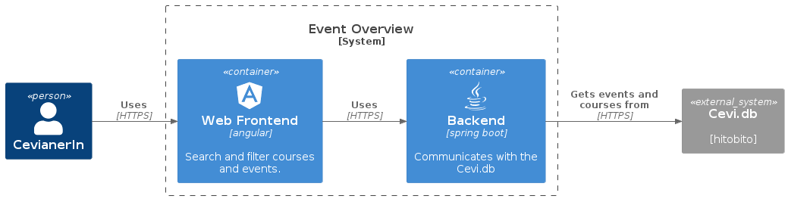

# Event Overview

Visit https://events.cevi.tools/

Allows the user to search and filter events and courses from the cevi.db. The data is loaded at startup and refreshed once per day.



## Prepare

Prerequisites
  * JDK 21
  * Node 18+
  * Cevi.DB API Token with Scope `Anlässe dieser Ebene`.

Put the token in a file and configure the file path in the environment variable APPLICATION_HITOBITO_API_TOKEN_FILE
```
APPLICATION_HITOBITO_API_TOKEN_FILE=/path_to_the_file_containing_the_token
```

## Build and run the backend

```
cd backend
./mvnw spring-boot:run
```

The backend is accessible under port 8080. e. g. http://localhost:8080/events. You can view an OpenApi specification under http://localhost:8080/swagger-ui/index.html

## Build and run the frontend

```
cd frontend
npm ci
ng serve
```
