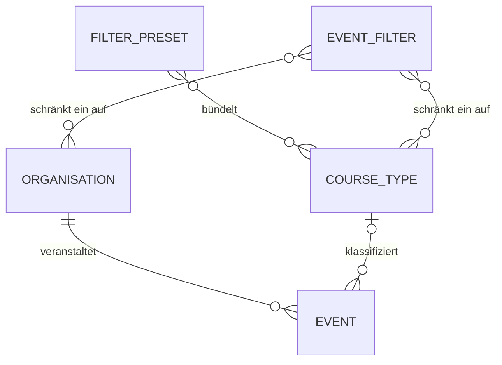

# Entity Model

Das System hält keinen eigenen persistenten Datenbestand. Die Anlässe und Kurse werden beim
Abgleich (UC-006) aus der Cevi.DB übernommen und im Arbeitsspeicher gehalten. Die hier
angegebenen Längen und Genauigkeiten beschreiben daher die fachlich erwarteten Wertebereiche
der aus der Cevi.DB übernommenen Angaben und nicht eine lokale Datenbankdefinition.

## Entity Relationship Diagram

### EVENT

Ein einzelner Termin eines Anlasses oder Kurses, wie er in der Übersicht als Zeile erscheint.

| Attribute            | Description                                                                                  | Data Type | Length/Precision | Validation Rules                       |
|----------------------|----------------------------------------------------------------------------------------------|-----------|------------------|----------------------------------------|
| id                   | Bezeichner des Angebots in der Cevi.DB; kommt bei mehreren Terminen desselben Angebots mehrfach vor | String    | 20               | Not Null                               |
| name                 | Bezeichnung des Anlasses oder Kurses                                                          | String    | 255              | Not Null                               |
| description          | Ausführliche Beschreibung des Angebots                                                        | String    | 4000             | Not Null                               |
| applicationLink      | Verweis auf die Anmeldung in der Cevi.DB                                                      | String    | 500              | Not Null, Format: URL                  |
| startsAt             | Beginn des Termins                                                                            | DateTime  | -                | Not Null                               |
| finishAt             | Ende des Termins, sofern bekannt                                                              | DateTime  | -                | Optional                               |
| group                | Durchführende Organisation                                                                    | String    | 100              | Not Null, Foreign Key (ORGANISATION.name) |
| location             | Durchführungsort                                                                              | String    | 255              | Not Null                               |
| kind                 | Kursart des Angebots; "N/A", wenn keine Kursart bekannt ist                                   | String    | 150              | Not Null, Foreign Key (COURSE_TYPE.name) |
| eventType            | Art des Angebots                                                                              | String    | 6                | Not Null, Values: EVENT, COURSE        |
| participantsCount    | Anzahl der bereits angemeldeten Teilnehmenden                                                 | Integer   | 10               | Not Null, Min: 0                       |
| maximumParticipants  | Obergrenze der Teilnehmenden; ohne Angabe gilt das Angebot als unbeschränkt                   | Integer   | 10               | Optional, Min: 0                       |
| applicationOpeningAt | Erster Tag, an dem eine Anmeldung möglich ist                                                 | Date      | -                | Optional                               |
| applicationClosingAt | Letzter Tag, an dem eine Anmeldung möglich ist                                                | Date      | -                | Optional                               |
| state                | Anmeldezustand eines Kurses, wie ihn die Cevi.DB führt                                        | String    | 50               | Optional                               |

### ORGANISATION

Eine Cevi-Organisation, die Anlässe oder Kurse durchführt und als Auswahlkriterium angeboten wird.

| Attribute | Description                                    | Data Type | Length/Precision | Validation Rules  |
|-----------|------------------------------------------------|-----------|------------------|-------------------|
| name      | Bezeichnung der Organisation, zugleich Schlüssel | String    | 100              | Not Null, Unique  |

### COURSE_TYPE

Eine Kursart, nach der Kurse eingeteilt und gefiltert werden, zum Beispiel "J+S-Expert*innenkurs LS/T".

| Attribute | Description                                | Data Type | Length/Precision | Validation Rules  |
|-----------|--------------------------------------------|-----------|------------------|-------------------|
| name      | Bezeichnung der Kursart, zugleich Schlüssel | String    | 150              | Not Null, Unique  |

### FILTER_PRESET

Ein fest hinterlegter beliebter Filter, der eine Gruppe zusammengehörender Kursarten unter einer
einprägsamen Bezeichnung anbietet, zum Beispiel "J+S-Leiter/-in werden".

| Attribute | Description                                                  | Data Type | Length/Precision | Validation Rules  |
|-----------|--------------------------------------------------------------|-----------|------------------|-------------------|
| label     | Bezeichnung des beliebten Filters, zugleich Schlüssel         | String    | 50               | Not Null, Unique  |

### EVENT_FILTER

Die vom Besucher gesetzten Kriterien, mit denen die Übersicht eingeschränkt wird; nicht gesetzte
Kriterien schränken nicht ein.

| Attribute          | Description                                                            | Data Type | Length/Precision | Validation Rules                 |
|--------------------|------------------------------------------------------------------------|-----------|------------------|----------------------------------|
| earliestStartAt    | Frühester zulässiger Starttag eines Angebots                            | Date      | -                | Optional                         |
| latestStartAt      | Spätester zulässiger Starttag eines Angebots                            | Date      | -                | Optional                         |
| nameContains       | Text, der in der Bezeichnung des Angebots enthalten sein muss           | String    | 255              | Optional                         |
| eventType          | Gesuchte Art des Angebots                                               | String    | 6                | Optional, Values: EVENT, COURSE  |
| hasAvailablePlaces | Verlangt Angebote mit beziehungsweise ohne freie Plätze                 | Boolean   | 1                | Optional                         |
| isApplicationOpen  | Verlangt Angebote mit beziehungsweise ohne offene Anmeldung             | Boolean   | 1                | Optional                         |
